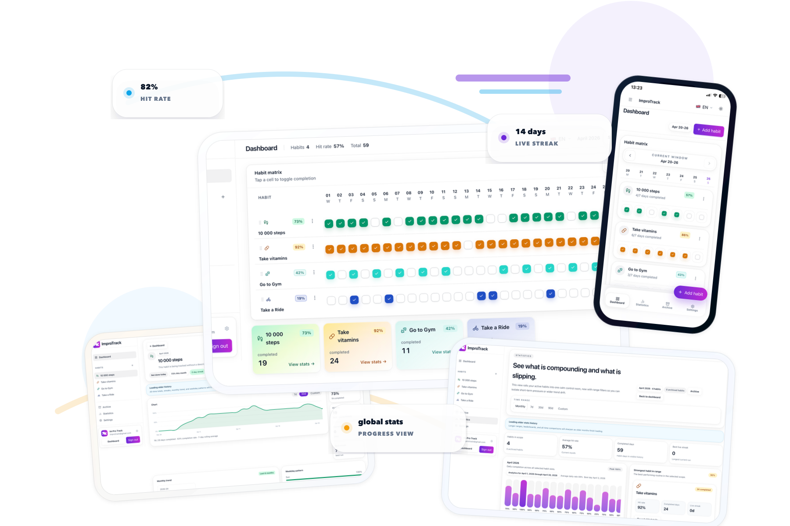

# ImproTrack

<p align="center">
  
</p>

<p align="center">
  <strong>A clean, installable habit-tracking PWA for visual progress, streaks, archives, and long-term statistics.</strong>
</p>

<p align="center">
  <a href="#stack"></a>
  <a href="#stack"></a>
  <a href="#stack"></a>
  <a href="#stack"></a>
  <a href="#license"></a>
</p>

---

## Why ImproTrack?

ImproTrack turns daily routines into a simple visual system: tap a cell, keep the streak alive, and zoom out when you want to understand what is compounding and what is slipping.

- **Habit matrix** with fast daily check-ins and color-coded completion.
- **Multi-slot habits** for routines that happen more than once per day.
- **Live streaks, hit rate, and totals** visible where decisions happen.
- **Statistics dashboard** for month, rolling-window, and archived habit analysis.
- **Archive support** so old habits stop cluttering your dashboard without losing history.
- **Installable PWA** with production service worker support and basic offline fallback.
- **Google sign-in + Firestore sync** for authenticated personal tracking.
- **Responsive UI** designed for desktop, tablet, mobile, and installed app usage.

## Stack

| Layer | Technology |
| --- | --- |
| App framework | Next.js 16.2.4 App Router |
| UI runtime | React 19 |
| Language | TypeScript 6 strict mode |
| Styling | Tailwind CSS v4 |
| Auth and data | Firebase Auth, Firestore, Firebase Storage helpers |
| Analytics | Vercel Analytics and Speed Insights |
| Package manager | pnpm 10.18.3 |
| Runtime | Node.js 22 |

## App routes

**Authenticated**

| Route | Purpose |
| --- | --- |
| `/dashboard` | Habit matrix |
| `/dashboard/archive` | Archived habits and history |
| `/dashboard/stats` | Progress analytics |
| `/dashboard/settings` | App preferences |

**Public**

| Route | Purpose |
| --- | --- |
| `/` | Marketing homepage |
| `/about`, `/features`, `/compare` | Product information pages |
| `/privacy`, `/terms` | Legal pages |
| `/sitemap` | Human-readable sitemap |
| `/offline` | PWA offline fallback |
| `/habit-tracker`, `/daily-habit-tracker`, `/routine-tracker`, `/simple-habit-tracker`, `/streak-tracker` | SEO landing pages |

Legacy `/archive` and `/habits/[slug]` routes redirect to their dashboard equivalents.

## Getting started

### 1. Use the pinned toolchain

```bash
nvm use
pnpm install
```

### 2. Configure environment variables

Create `.env.local` from `.env.example`:

```bash
cp .env.example .env.local
```

Fill in the Firebase web app values:

```bash
NEXT_PUBLIC_FIREBASE_API_KEY=your-firebase-api-key
NEXT_PUBLIC_FIREBASE_AUTH_DOMAIN=your-project.firebaseapp.com
NEXT_PUBLIC_FIREBASE_PROJECT_ID=your-project-id
NEXT_PUBLIC_FIREBASE_STORAGE_BUCKET=your-project.firebasestorage.app
NEXT_PUBLIC_FIREBASE_MESSAGING_SENDER_ID=your-messaging-sender-id
NEXT_PUBLIC_FIREBASE_APP_ID=your-firebase-app-id
```

Set the canonical public site URL when deploying:

```bash
NEXT_PUBLIC_SITE_URL=https://your-domain.example
```

`NEXT_PUBLIC_SITE_URL` drives `metadataBase`, canonical/social URLs, `/sitemap.xml`, and `/robots.txt`. If it is missing, the app falls back to `SITE_URL`, Vercel URL variables, and then `http://localhost:3000`.

### 3. Run locally

```bash
pnpm dev
```

If you test from another device on your LAN, set `NEXT_ALLOWED_DEV_ORIGINS` to a comma-separated list of additional hostnames or IP addresses before starting Next.js.

## Commands

| Command | Description |
| --- | --- |
| `pnpm dev` | Start the local development server |
| `pnpm typecheck` | Run TypeScript with `tsc --noEmit` |
| `pnpm build` | Create a production Next.js build |
| `pnpm start` | Serve the production build |
| `pnpm check` | Run typecheck and production build |

There is currently no lint script or automated test runner configured.

## Firebase setup notes

- Firebase config is resolved lazily so CI can prerender public routes without shipping Firebase secrets.
- Sign-in, Firestore, and Storage-backed flows still require `NEXT_PUBLIC_FIREBASE_*` values at runtime.
- Authentication is Google-only.
- Add every local and deployed origin you use to **Firebase Console -> Authentication -> Settings -> Authorized domains**.
- Installed PWAs use the same origin as the browser tab, so Google sign-in will fail if that origin is not authorized.

## PWA and offline behavior

ImproTrack includes a lightweight service worker for production builds. It caches the public shell, core dashboard routes, and static assets so the app can feel installable and provide a basic offline fallback.

Important details:

- `pnpm dev` does **not** register the service worker.
- Use `pnpm build && pnpm start` to validate install and offline behavior locally.
- Google sign-in and fresh Firestore sync require a live network connection.
- Cached screens can load offline, but auth refreshes and new data writes wait for connectivity.
- Chromium browsers can use the in-app install prompt.
- On iOS Safari, install with **Share -> Add to Home Screen**.

## SEO

The project ships with static SEO routes:

- `/sitemap.xml` includes public static pages only.
- `/robots.txt` points crawlers to the sitemap and blocks authenticated areas.
- `/sitemap` provides a human-readable sitemap page.

Crawlers are blocked from:

- `/dashboard`
- `/archive`
- `/habits`

Dashboard routes also emit `noindex` metadata at the layout level.

## Project structure

```text
app/         Next.js route wrappers, metadata, sitemap, robots, manifest
components/  Public pages, dashboard shell, habit UI, PWA controller
lib/         Date, stats, storage, Firebase, site URL, and habit helpers
public/      Static assets, brand images, icons, service worker
workers/     Standalone reminder-cron worker (its own package with node_modules)
scripts/     Brand asset generation utilities
```

Key architecture rules:

- Route files stay thin and render components from `components/`.
- Use `lib/storage.ts` hooks for habit state instead of writing directly to Firestore from components.
- Keep Firebase access behind helpers in `lib/firebase/`.
- Dates are `YYYY-MM-DD` strings from `lib/date.ts`.
- Theme tokens and reusable utility classes live in `app/globals.css`; this project does not use `tailwind.config.ts`.

## Docker

Docker setup details live in [`DOCKER.md`](DOCKER.md).

## Contributing

This project is open for experimentation and personal use. Before opening a pull request:

1. Use Node.js 22 with the pinned pnpm version.
2. Keep app routes thin and put UI logic in `components/`.
3. Reuse storage, date, stats, and Firebase helpers instead of duplicating logic.
4. Run `pnpm check` before submitting changes.

## License

ImproTrack is planned to be free to use under the MIT License. A formal root `LICENSE` file has not been added yet, so treat this README as the current license intent rather than the complete legal license text.
